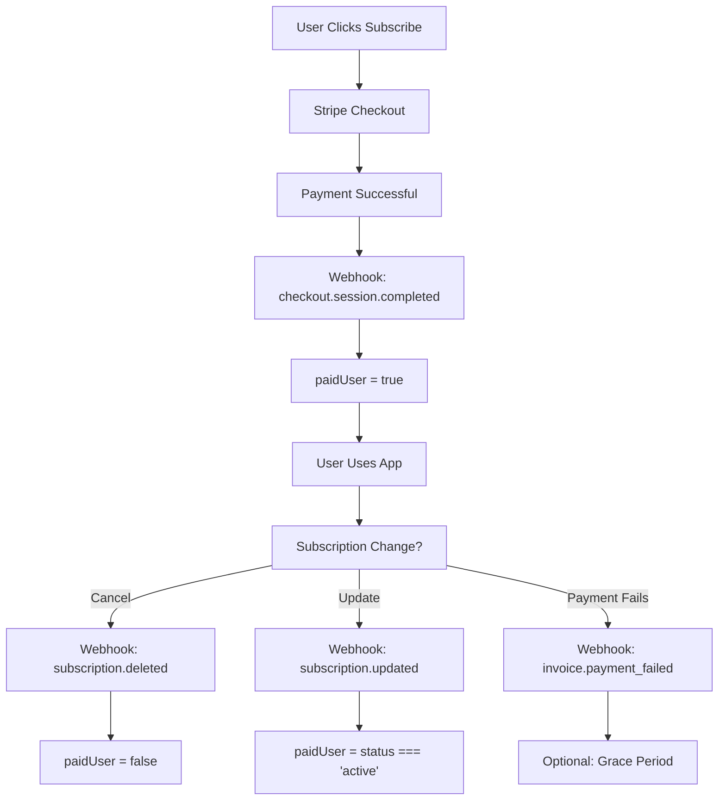

# 💰 `paidUser` Column Management Guide

## 🎯 Overview
Your `profiles.paidUser` column is automatically managed through the Stripe webhook system. Here's exactly when and how it gets updated:

## 🔄 Complete Subscription Lifecycle

### 1. **✅ Subscription Activation** (`checkout.session.completed`)
```typescript
// When user completes payment
const { error: updateError } = await supabase
  .from('profiles')
  .update({ 
    paidUser: true,              // ← Sets to TRUE
    paid_status: true,
    isPaid: true,
    premium: true,
    stripe_customer_id: session.customer,
    stripe_subscription_id: subscriptionId,
    subscription_status: 'active',
    subscription_created_at: new Date().toISOString(),
  })
  .eq('id', userId);
```
**Result**: `paidUser` = `true` when payment is successful

### 2. **❌ Subscription Cancellation** (`customer.subscription.deleted`)
```typescript
// When user cancels subscription
const { error: updateError } = await supabase
  .from('profiles')
  .update({ 
    paidUser: false,             // ← Sets to FALSE
    paid_status: false,
    isPaid: false,
    premium: false,
    subscription_status: 'cancelled',
    subscription_cancelled_at: new Date().toISOString(),
  })
  .match(updateFilter);
```
**Result**: `paidUser` = `false` when subscription is cancelled

### 3. **🔄 Subscription Status Changes** (`customer.subscription.updated`)
```typescript
// When subscription status changes (active, past_due, etc.)
const isActive = status === 'active';
const updateData = {
  subscription_status: status,
  paidUser: isActive,          // ← TRUE if active, FALSE if not
  paid_status: isActive,
  isPaid: isActive,
  premium: isActive,
  stripe_subscription_id: subscription.id,
};
```
**Result**: `paidUser` reflects current subscription status

### 4. **💳 Payment Failures** (`invoice.payment_failed`)
```typescript
// Currently logs the failure - you can customize this behavior
console.log('Payment failed for customer:', customerId);
// Could set paidUser: false after grace period
```

## 🎯 Status Mapping

| Stripe Status | `paidUser` Value | Description |
|---------------|------------------|-------------|
| `active` | `true` | ✅ Subscription is active and paid |
| `past_due` | `false` | ⚠️ Payment failed, grace period |
| `cancelled` | `false` | ❌ Subscription cancelled |
| `unpaid` | `false` | ❌ Payment failed, no grace period |
| `incomplete` | `false` | ⚠️ Payment processing incomplete |

## 🛡️ Safety Mechanisms

### **Double User Linking**
```typescript
// Primary: Direct user ID lookup
if (userId) {
  updateFilter.id = userId;
}
// Backup: Stripe customer ID lookup
else {
  updateFilter.stripe_customer_id = customerId;
}
```

### **User Existence Verification**
```typescript
// Verify user exists before updating
const { data: existingUser, error: userError } = await supabase
  .from('profiles')
  .select('id, email')
  .eq('id', userId)
  .single();

if (userError || !existingUser) {
  console.error('User not found');
  return;
}
```

## 🔍 How to Check `paidUser` Status

### **In Your App Components**
```typescript
// Check if user has paid access
const { data: profile } = await supabase
  .from('profiles')
  .select('paidUser, premium, subscription_status')
  .eq('id', user.id)
  .single();

if (profile?.paidUser) {
  // Show premium features
} else {
  // Show free tier or upgrade prompt
}
```

### **SQL Query for Admin Dashboard**
```sql
-- Check all subscription statuses
SELECT 
  id,
  email,
  paidUser,
  subscription_status,
  stripe_customer_id,
  subscription_created_at
FROM profiles 
WHERE paidUser = true
ORDER BY subscription_created_at DESC;
```

## 🚨 Troubleshooting

### **If `paidUser` Doesn't Update**
1. **Check webhook endpoint** - Is it receiving events?
2. **Check webhook secret** - Is `STRIPE_WEBHOOK_SECRET` correct?
3. **Check logs** - Look for error messages in webhook handler
4. **Manual update** - Use success page as backup

### **Manual Status Update** (Emergency)
```sql
-- Manually set user as paid (use sparingly)
UPDATE profiles 
SET 
  paidUser = true,
  premium = true,
  subscription_status = 'active'
WHERE id = 'user-uuid-here';
```

### **Test Subscription Status**
```sql
-- Find users with mismatched statuses
SELECT 
  id, email, paidUser, subscription_status,
  CASE 
    WHEN paidUser = true AND subscription_status != 'active' THEN 'MISMATCH: Paid but not active'
    WHEN paidUser = false AND subscription_status = 'active' THEN 'MISMATCH: Active but not paid'
    ELSE 'OK'
  END as status_check
FROM profiles 
WHERE paidUser IS NOT NULL;
```

## 📊 Real-time Status Flow



## ✅ Your Current Setup

Your system is already configured to:
- ✅ Set `paidUser = true` when payment succeeds
- ✅ Set `paidUser = false` when subscription cancels
- ✅ Update `paidUser` based on subscription status changes
- ✅ Handle user linking through multiple methods
- ✅ Provide detailed logging for debugging

The `paidUser` column is fully automated and production-ready! 🚀 