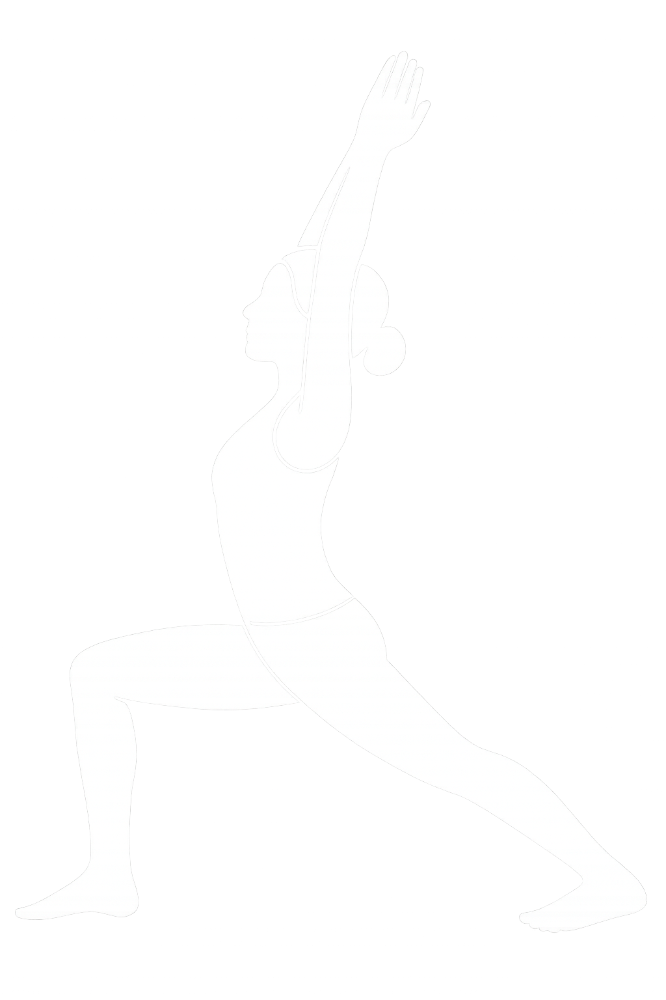

# 🧘‍♀️ Yotion.ai - AI-Powered Yoga Pose Tracking

<div align="center">
  
  <h1>Transform Your Yoga Practice with Real-Time AI Guidance</h1>
  <p>Advanced pose tracking, form correction, and performance analytics powered by MediaPipe and AI</p>
</div>

## ✨ Features

### 🎯 **Real-Time Pose Tracking**
- **MediaPipe Integration**: Advanced pose detection using Google's MediaPipe framework
- **Smooth Tracking**: Exponential Moving Average (EMA) smoothing for stable, jitter-free tracking
- **Multi-Pose Support**: Track and analyze various yoga poses with custom angle configurations
- **Face Filtering**: Clean pose visualization by filtering out face landmarks

### 🏃‍♀️ **Form Correction & Guidance**
- **Real-Time Feedback**: Instant voice and text guidance for pose adjustments
- **Angle Analysis**: Precise joint angle calculations for elbows, knees, shoulders, and hips
- **Tolerance-Based Correction**: Customizable tolerance ranges for each joint
- **Visual Indicators**: Color-coded landmarks (green = correct, red = needs adjustment)

### 📊 **Performance Analytics**
- **Interactive Charts**: Beautiful blue-themed visualizations using Recharts
- **Progress Tracking**: Daily pose count and performance metrics
- **Data Visualization**: Bar charts, line charts, and pie charts for comprehensive insights
- **Historical Data**: Track your yoga journey over time

### 🔐 **User Management**
- **Supabase Authentication**: Secure user registration and login
- **Profile Management**: Personalized settings and preferences
- **Session Management**: Persistent login with cookie-based auth
- **Protected Routes**: Secure access to personal data and features

### 🎨 **Modern UI/UX**
- **Responsive Design**: Works seamlessly on desktop and mobile devices
- **Tailwind CSS**: Beautiful, consistent styling
- **shadcn/ui Components**: Professional, accessible UI components
- **Dark/Light Mode**: Comfortable viewing in any lighting condition

## 🛠️ Technology Stack

### **Frontend**
- **Next.js 14**: React framework with App Router
- **TypeScript**: Type-safe development
- **Tailwind CSS**: Utility-first CSS framework
- **shadcn/ui**: High-quality React components
- **Recharts**: Beautiful, composable charting library

### **AI & Computer Vision**
- **MediaPipe**: Google's ML framework for pose detection
- **PoseLandmarker**: Advanced pose tracking with 33 body landmarks
- **Custom Smoothing**: EMA algorithm for stable tracking

### **Backend & Database**
- **Supabase**: Open-source Firebase alternative
- **PostgreSQL**: Robust relational database
- **Real-time Subscriptions**: Live data updates
- **Row Level Security**: Secure data access

### **Authentication & Security**
- **Supabase Auth**: Password-based authentication
- **Cookie-based Sessions**: Secure session management
- **Middleware Protection**: Route-level security

## 🚀 Getting Started

### Prerequisites
- Node.js 18+ 
- npm, yarn, or pnpm
- Supabase account

### Installation

1. **Clone the repository**
   ```bash
   git clone https://github.com/yourusername/yotion.ai.git
   cd yotion.ai
   ```

2. **Install dependencies**
   ```bash
   npm install
   # or
   yarn install
   # or
   pnpm install
   ```

3. **Set up Supabase**
   - Create a new project at [supabase.com](https://supabase.com)
   - Get your project URL and anon key from Settings > API

4. **Configure environment variables**
   ```bash
   cp .env.example .env.local
   ```
   
   Update `.env.local` with your Supabase credentials:
   ```env
   NEXT_PUBLIC_SUPABASE_URL=your_supabase_project_url
   NEXT_PUBLIC_SUPABASE_ANON_KEY=your_supabase_anon_key
   ```

5. **Run the development server**
   ```bash
   npm run dev
   # or
   yarn dev
   # or
   pnpm dev
   ```

6. **Open your browser**
   Navigate to [http://localhost:3000](http://localhost:3000)

## 📱 Usage Guide

### **Getting Started with Pose Tracking**
1. **Sign up/Login**: Create an account or sign in
2. **Select a Pose**: Choose from available yoga poses
3. **Position Yourself**: Stand in front of your camera
4. **Follow Guidance**: Listen to real-time form corrections
5. **Track Progress**: View your performance analytics

### **Understanding the Interface**
- **Green Landmarks**: Correct joint angles
- **Red Landmarks**: Joints that need adjustment
- **Blue Landmarks**: Neutral tracking points
- **Voice Feedback**: Audio guidance for corrections
- **Performance Charts**: Visual progress tracking

### **Customizing Pose Tolerance**
Each pose has configurable tolerance ranges for:
- Elbow angles (left/right)
- Knee angles (left/right)
- Shoulder angles (left/right)
- Hip angles (left/right)

## 🔧 Configuration

### **Smoothing Settings**
Adjust tracking stability in `components/poseCorrection.tsx`:
```typescript
// More stable (less responsive)
alpha = 0.4

// Balanced (current setting)
alpha = 0.5

// More responsive (less stable)
alpha = 0.7
```

## 📊 Database Schema

### **Users Table**
- User profiles and authentication data
- Performance history and preferences

### **Pose Library**
- Pose definitions and angle configurations
- Reference images and descriptions

### **Performance Data**
- Daily pose counts and metrics
- Historical tracking data

### **Development Setup**
1. Fork the repository
2. Create a feature branch
3. Make your changes
4. Add tests if applicable
5. Submit a pull request

## 🙏 Acknowledgments

- **MediaPipe**: Google's pose detection framework
- **Supabase**: Backend infrastructure
- **shadcn/ui**: Beautiful UI components
- **Recharts**: Charting library
- **Next.js**: React framework

---

<div align="center">
  <p>Made with ❤️ by our team</p>
  <p>Transform your practice with AI-powered guidance</p>
</div>
